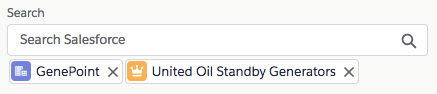

# Salesforce Lightning Lookup Component

## About
This is a generic &amp; customizable lookup component built using Salesforce Lightning and [SLDS](https://www.lightningdesignsystem.com/) style. 
It does not rely on third party libraries and you have full control over its datasource.

<b>Features</b>

The Lightning Lookup component provides the following features:
- customizable data source that can return mixed sObject types
- single or multiple selection mode
- client-side caching
- built-in server request rate limit mechanism

## Documentation
Component is documented using Aura documentation. 
You can access it from this URL (replace the domain): 
https://<b>&lt;YOUR_DOMAIN&gt;</b>.lightning.force.com/auradocs/reference.app#reference?descriptor=c:Lookup&defType=component

## Salesforce DX setup instructions
Create a scratch org: 
`sfdx force:org:create -s -f config/project-scratch-def.json -a lookup`

Push the sources to it: 
`sfdx force:source:push`

Log in and open the sample app: 
`sfdx force:org:open -p c/SampleLookupApp.app`

## Sample application
The default installation installs the Lookup component and a sample application available under this URL (replace the domain): 
https://<b>&lt;YOUR_DOMAIN&gt;</b>.lightning.force.com/c/SampleLookupApp.app

If you wish to install the project without the sample application, edit `sfdx-project.json` and remove the `src-sample` path.
